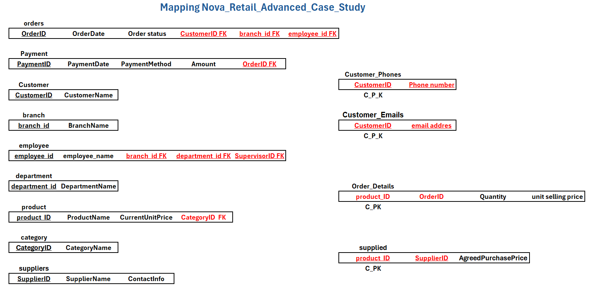
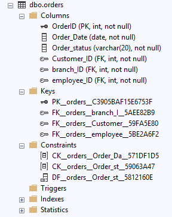
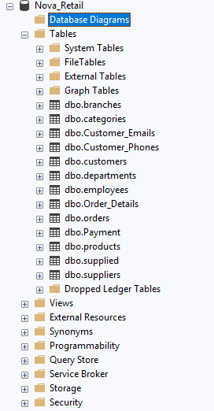

# 🛒 Nova Retail Group — Enterprise Database System

An enterprise-grade Relational Database Management System (RDBMS) designed and implemented for **Nova Retail Group** using **Microsoft SQL Server**.

This system centralizes multi-branch retail operations, handling customer interactions, multi-supplier products, inventory categorization, order processing, and multi-method payment splits.

---

## 📌 Executive Summary & Business Context

Nova Retail Group operates across multiple branches with complex procurement and sales workflows.

The goal of this project is to model and deploy a normalized database schema that enforces **Entity, Domain, and Referential Integrity** while solving key operational constraints:

- **Multi-Supplier Dynamics:** Products can be supplied by multiple vendors, with contractually agreed purchase prices tracked per supplier through the `supplied` junction table.

- **Recursive Employee Supervision:** Organizational hierarchy is mapped through a self-referencing relationship using `Supervisor_ID` within the `employees` table.

- **Order Line-Item Integrity:** Product selling prices are locked at the time of purchase using `UnitSellingPrice` to preserve historical accuracy against future product price changes.

- **Flexible Split Payments:** A single order can be paid across multiple transactions and payment methods such as `Cash`, `Card`, `Wallet`, and `Bank Transfer`.

- **Data Cleansing Readiness:** The database is designed to handle real-world legacy data edge cases, including trailing spaces, inconsistent case sensitivity, and missing contact records.

---

## 📁 Project Directory Structure

```text
Nova-Retail-Database/
│
├── Data_Exports/
│   └── Nova_Retail_Mapping_And_Data.xlsx
│
├── SQL/
│   └── 01_Nova_Retail_Schema_And_Data.sql
│
├── docs/
│   ├── Business_Requirements.pdf
│   ├── Conceptual_ERD.png
│   ├── Orders_Table_Constraints.png
│   ├── Physical_Database_Diagram.png
│   ├── Relational_Mapping.png
│   └── Tables_List_View.png
│
└── README.md
````

---

## 📎 Project Files

### 📊 Data Dictionary & Mapping

[📥 Download Nova Retail Mapping & Data Excel File](Data_Exports/Nova_Retail_Mapping_And_Data.xlsx)

Contains the project's data dictionary, source mapping, and raw data preparation sets.

### 🗃️ SQL Database Script

[📥 Open SQL Schema & Data Script](SQL/01_Nova_Retail_Schema_And_Data.sql)

Contains the complete:

* Database creation
* Table definitions
* Primary Keys
* Foreign Keys
* CHECK constraints
* UNIQUE constraints
* Referential integrity rules
* Seed / test data
* Edge-case test scenarios

### 📋 Business Requirements

[📄 View Business Requirements](docs/Business%20Requirements.pdf)

Contains the project specifications, business requirements, and scope definition.

---

# 🖼️ Architecture & Database Diagrams

## 📐 Conceptual ERD

The conceptual ERD represents the high-level business entities and their relationships.


---

## 🔗 Relational Mapping

The relational mapping shows how the conceptual model was transformed into relational tables.



---

## 🏛️ Physical Database Diagram

The physical database diagram shows the implemented database structure, including primary keys, foreign keys, and table relationships.


---

## ⚙️ Orders Table Constraints & Schema Details

Technical documentation of the `orders` table, including its constraints and schema implementation.



---

## 🗃️ SSMS Tables List View

The following screenshot shows the implemented database tables inside SQL Server Management Studio (SSMS).



---

# 🗂️ Relational Schema & Table Definitions

The system resolves **M:N relationships** into explicit junction tables to support normalization and maintain **3NF compliance**.

| Table Name          | Primary Key (PK)               | Key Foreign Keys (FK)                         | Core Constraints & Business Logic                                                        |
| ------------------- | ------------------------------ | --------------------------------------------- | ---------------------------------------------------------------------------------------- |
| **customers**       | `Customer_ID`                  | None                                          | Primary customer records.                                                                |
| **Customer_Phones** | `(Customer_ID, Phone_Number)`  | `Customer_ID`                                 | Resolves multi-valued phone attributes with `CASCADE` delete.                            |
| **Customer_Emails** | `(Customer_ID, Email_Address)` | `Customer_ID`                                 | Resolves multi-valued email attributes with `CASCADE` delete.                            |
| **branches**        | `branch_ID`                    | None                                          | Physical retail store locations. `branch_Name` is UNIQUE.                                |
| **departments**     | `department_ID`                | None                                          | Corporate organizational units. `department_Name` is UNIQUE.                             |
| **categories**      | `CategoryID`                   | None                                          | Product categorization hierarchy. `CategoryName` is UNIQUE.                              |
| **suppliers**       | `Supplier_ID`                  | None                                          | Product vendors and supplier details.                                                    |
| **employees**       | `employee_ID`                  | `branch_ID`, `department_ID`, `Supervisor_ID` | Self-referencing FK for supervisor hierarchy.                                            |
| **products**        | `Product_ID`                   | `CategoryID`                                  | Stores default `CurrentUnitPrice >= 0`.                                                  |
| **supplied**        | `(Supplier_ID, Product_ID)`    | `Supplier_ID`, `Product_ID`                   | M:N junction table; stores `AgreedPurchasePrice >= 0`.                                   |
| **orders**          | `OrderID`                      | `Customer_ID`, `branch_ID`, `employee_ID`     | Status constrained to `Pending`, `Completed`, `Cancelled`, `Returned`.                   |
| **Order_Details**   | `(OrderID, ProductID)`         | `OrderID`, `ProductID`                        | M:N junction table; enforces `Quantity > 0` and preserves historical `UnitSellingPrice`. |
| **Payment**         | `Payment_ID`                   | `OrderID`                                     | Supports split payments across `Cash`, `Card`, `Wallet`, and `Bank Transfer`.            |

---

# ⚙️ Deployment & Execution Guide

To deploy this database locally using **Microsoft SQL Server**:

## 1. Get the Repository

### Option A — Clone via Git

```bash
git clone https://github.com/Mohamed3mad123/Nova-Retail-Database.git
```

Then navigate to the project directory:

```bash
cd Nova-Retail-Database
```

### Option B — Download ZIP

Click the green **Code** button on the GitHub repository page and select:

**Download ZIP**

---

## 2. Execute the SQL Script

Open **SQL Server Management Studio (SSMS)**.

Open:

```text
SQL/01_Nova_Retail_Schema_And_Data.sql
```

Execute the script using:

```text
F5
```

The script will:

1. Create the `Nova_Retail` database.
2. Create the required tables.
3. Define Primary Keys and Foreign Keys.
4. Apply integrity and business-rule constraints.
5. Insert seed/test data.
6. Provide edge cases for validation.

---

# 📊 Sample Test Data & Edge Cases

The included DML seed script accommodates and validates several realistic operational scenarios:

### ✅ Duplicate Customer Names

Customers can share the same name while remaining uniquely identified through `Customer_ID`.

Example:

```text
Mohamed Khalil → Customer_ID 1
Mohamed Khalil → Customer_ID 2
```

---

### ✅ Split Payments

A single order can be distributed across multiple payment methods.

Example:

```text
OrderID 10001
├── Cash
└── Card
```

---

### ✅ Unassigned Departments

Departments can exist without currently assigned employees.

Example:

```text
Research & Development
```

---

### ✅ Executive Hierarchy

Senior executives can have a `NULL` supervisor because they represent the top level of the organizational hierarchy.

Example:

```text
Ahmed Hassan → CEO
Supervisor_ID → NULL
```

---

### ✅ Multi-Vendor Products

The database supports products supplied by multiple vendors with different agreed purchase prices.

Example:

```text
Wireless Gaming Mouse

Vendor 1 → $25.00
Vendor 2 → $22.50
```

---

# 🧠 Key Database Design Concepts Demonstrated

This project demonstrates practical implementation of:

* Relational Database Design
* ERD Modeling
* Conceptual → Relational → Physical Mapping
* Normalization up to 3NF
* Primary & Foreign Keys
* Composite Primary Keys
* Many-to-Many Relationships
* Junction Tables
* Self-Referencing Relationships
* Referential Integrity
* Entity Integrity
* Domain Integrity
* CHECK Constraints
* UNIQUE Constraints
* CASCADE Delete
* Historical Transaction Data Preservation
* Split Payment Modeling
* SQL Server DDL & DML
* Data Quality & Edge-Case Handling

---

# 🛠️ Technologies

* **Microsoft SQL Server**
* **SQL Server Management Studio (SSMS)**
* **SQL**
* **Excel**
* **ERD / Database Modeling**

---

# 👤 Author

**Mohamed Emad Hamdy**

Data Analyst | SQL | Power BI | Excel

[GitHub](https://github.com/Mohamed3mad123)
