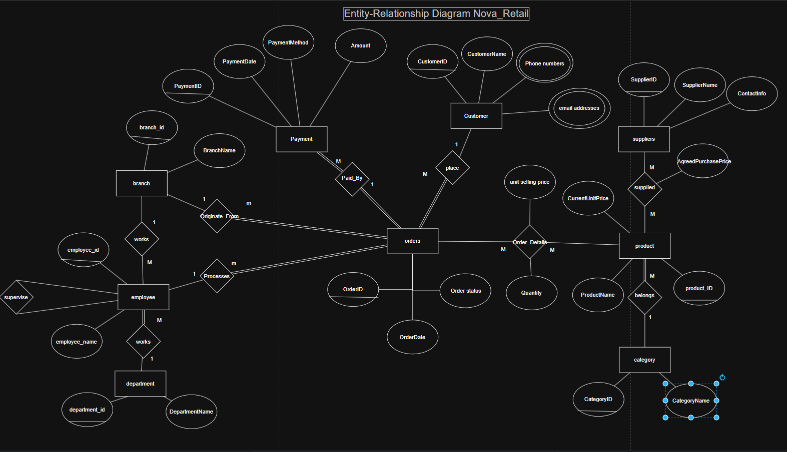
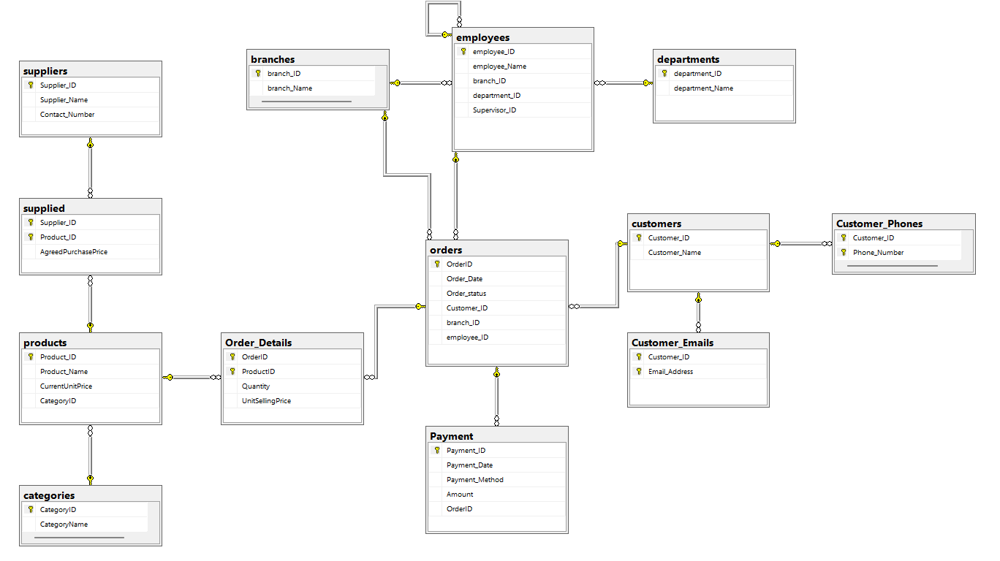

```markdown
# 🛒 Nova Retail Group — Enterprise Database System


An enterprise-grade Relational Database Management System (RDBMS) designed and implemented for **Nova Retail Group** using **Microsoft SQL Server**. This system centralizes multi-branch retail operations, handling customer interactions, multi-supplier products, inventory categorization, order processing, and multi-method payment splits.

---

## 📌 Executive Summary & Business Context

Nova Retail Group operates across multiple branches with complex procurement and sales workflows. The goal of this project is to model and deploy a normalized database schema that enforces **Entity, Domain, and Referential Integrity** while solving key operational constraints:

* **Multi-Supplier Dynamics:** Products can be supplied by multiple vendors, with contractually agreed purchase prices tracked per supplier (`supplied` junction table).
* **Recursive Employee Supervision:** Organizational hierarchy is mapped via self-referencing relationships (`Supervisor_ID` within `employees`).
* **Order Line-Item Integrity:** Product selling prices are locked at the time of purchase (`UnitSellingPrice`) to preserve historical accuracy against future product price edits.
* **Flexible Split Payments:** Single orders can be paid across multiple transactions and payment methods (`Cash`, `Card`, `Wallet`, `Bank Transfer`).
* **Data Cleansing Readiness:** Designed to handle real-world legacy data edge cases (trailing spaces, inconsistent case sensitivity, missing contact records).

---

## 📐 Conceptual & Physical Architecture

### 1. Conceptual ERD (Chen's Notation)
The high-level relational entities, multi-valued attributes, and cardinality constraints ($1:1$, $1:N$, $M:N$):



### 2. Physical Database Schema (Diagram)
The implemented database diagram generated directly from SQL Server Management Studio (SSMS), displaying Primary Keys ($PK$), Foreign Keys ($FK$), and table relationships:



---

## 🗂️ Relational Schema & Table Definitions

The system resolves $M:N$ relationships into explicit junction tables to ensure 3NF compliance:

| Table Name | Primary Key ($PK$) | Key Foreign Keys ($FK$) | Core Constraints & Business Logic |
| :--- | :--- | :--- | :--- |
| **`customers`** | `CustomerID` | None | Primary customer records. |
| **`Customer_Phones`** | `(CustomerID, Phone_Number)` | `CustomerID` | Resolves multi-valued phone attributes. |
| **`Customer_Emails`** | `(CustomerID, Email_Address)`| `CustomerID` | Resolves multi-valued email attributes. |
| **`departments`** | `department_ID` | None | Corporate organizational units. |
| **`branches`** | `branch_ID` | None | Physical retail store locations. |
| **`employees`** | `employee_ID` | `department_ID`, `branch_ID`, `Supervisor_ID` | Self-referencing FK for supervisor hierarchy. |
| **`categories`** | `CategoryID` | None | Product categorization hierarchy. |
| **`products`** | `Product_ID` | `CategoryID` | Stores current default unit selling price. |
| **`suppliers`** | `Supplier_ID` | None | Product vendors and supplier details. |
| **`supplied`** | `(Supplier_ID, Product_ID)` | `Supplier_ID`, `Product_ID` | M:N Junction; stores `AgreedPurchasePrice`. |
| **`orders`** | `OrderID` | `Customer_ID`, `branch_ID`, `employee_ID` | Status constrained to `Pending`, `Completed`, `Cancelled`, `Returned`. |
| **`Order_Details`**| `(OrderID, ProductID)` | `OrderID`, `ProductID` | M:N Junction; locks `Quantity > 0` & historical `UnitSellingPrice`. |
| **`Payment`** | `Payment_ID` | `OrderID` | Payment split logic; Method constrained to `Cash`, `Card`, `Wallet`, `Bank Transfer`. |

---

## 🛠️ Repository File Structure

```text
Nova-Retail-Database/
│
├── SQL/
│   └── 01_Nova_Retail_Schema_And_Data.sql    # Complete T-SQL script (DDL + DML Test Data)
│
├── Data_Exports/
│   └── Nova_Retail_Mapping_And_Data.xlsx     # Data dictionary and exported mapping datasets
│
├── docs/
│   ├── Business_Requirements.pdf              # Formal Case Study specifications
│   ├── Conceptual_ERD.png                     # Conceptual ER Diagram (Chen's notation)
│   ├── Physical_Database_Diagram.png        # Physical SSMS Database Schema Diagram
│   ├── Relational_Mapping.png                 # Complete relational mapping documentation
│   ├── Orders_Table_Constraints.png         # Physical table structure & constraint details
│   └── Tables_List_View.png                 # SSMS Object Explorer schema list
│
└── README.md                                  # Executive repository documentation

```

---

## ⚙️ Deployment & Execution Guide

To deploy this database locally on Microsoft SQL Server:

1. Clone this repository:
```bash
git clone [https://github.com/Mohamed3mad123/Nova-Retail-Database.git](https://github.com/Mohamed3mad123/Nova-Retail-Database.git)

```


2. Open **SQL Server Management Studio (SSMS)**.
3. Open the script file `SQL/01_Nova_Retail_Schema_And_Data.sql`.
4. Execute the script (`F5`). It will automatically:
* Create the `NovaRetailDB` database.
* Define all 12 tables with strict `CHECK`, `NOT NULL`, `DEFAULT`, and `FOREIGN KEY` constraints.
* Seed edge-case test data (duplicate customer names, multi-payment splits, null emails, spaces in phone numbers) to validate domain rules.


---

## 📊 Sample Test Data Edge Cases Verified

The included DML seed script validates the following business scenarios:

* ✅ Duplicate customer names with unique `CustomerID` tracking.
* ✅ Orders split across multiple payment methods (`Cash` + `Card`).
* ✅ Department created with zero assigned employees.
* ✅ Senior executives with `NULL` supervisors.
* ✅ Products mapped to multiple vendors with distinct `AgreedPurchasePrice` rates.

```

```